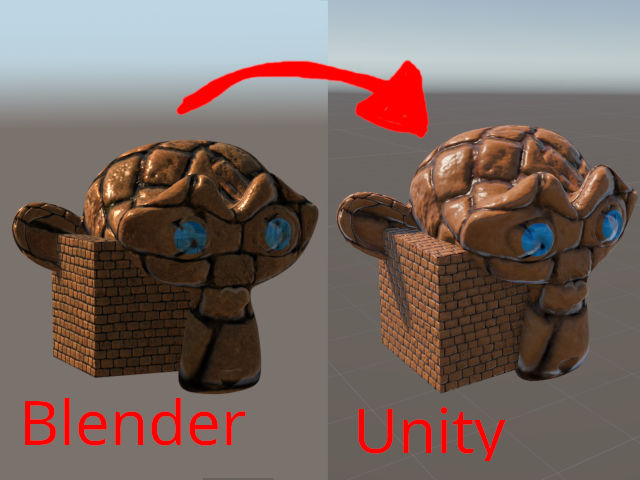
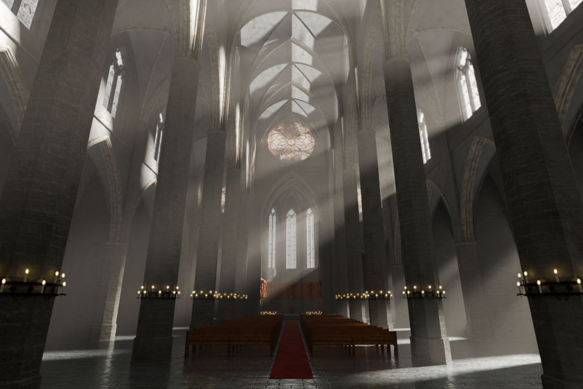

# Skripte Sammlung für Blender von TheWhiteShadow

Dies ist eine Sammlung von Blender Skripten die ich an dieser Stelle zur freien Verfügung stelle.
Wenn nicht anders erwähnt sind alle Skripte mit der Version 4.4 getestet und können einfach als Addon installiert werden.

## Inhalt

### Unity Model Exporter
Vereinfacht das Exportieren von Meshs nach Unity und automatisiert den Export von zugehörigen Materialien und Texturen.

### Arch Ceil
Erstellt ein Rund- oder Spitzbogengewölbe.

Die Funktion hat zahlreiche Parameter neben Größe und Ausrichtung:
- **Edges** Bei 2 Seiten erhält man lediglich einen Bogen, bei 4 eine X-Kreuzung, etc.
- **Radius** Die Höhe lässt sich einstellen von rund bis sehr spitz.
- **Extrude** Der Extrude Parameter erlaubt passende Außen und Innen Bögen.
- **Steps** Die Auflösung des Bogens. Mehr = Runder.

