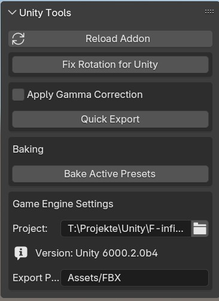
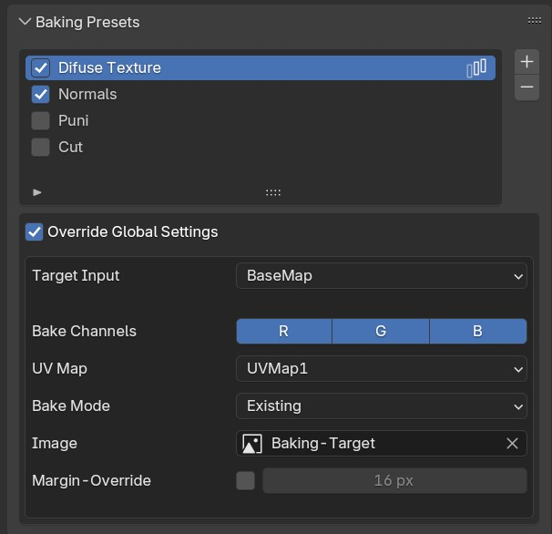

# Unity Tools – Blender Addon

Professional Blender addon for exporting assets to game engines (Unity/Godot) with automatic material conversion and comprehensive texture baking system.

---

## Main Features

### 🎨 **Material-Based Texture Baking**
Convert complex shader setups into game-ready PBR textures with a flexible preset system. Supports multi-pass baking, per-material overrides, and automatic batch processing.

### 📦 **FBX Export with Material Conversion**
One-click export to Unity/Godot with automatic generation of engine-native materials. The addon automatically creates JSON metadata and copies a Unity editor script for import handling.

### 🧵 **Cloth/Surface Animation Rigging**
Automatic bone rig generation for cloth simulations or animated surfaces. Automatically creates a deformed copy with armature modifier for clean baking.

### 🔧 **Object Cleanup & Merge Tools**
Collection-based merging with automatic modifier application, hair particle conversion, and comprehensive mesh cleanup operations (unconnected vertices, unused materials, vertex groups, etc.).

---

## Installation

1. Create a ZIP from the `unity` folder contents
2. In Blender: `Edit` > `Preferences` > `Add-ons` > `Install...`
3. Select the ZIP and enable "Unity Tools"
4. The panel appears in the 3D Viewport under `N` > `Game Tools`

---

## Modules in Detail

### Material Baking

**Location:** Properties Panel > Material Properties > "Baking Presets"

**Purpose:** Convert shader inputs (Metallic, Roughness, Emission, etc.) into textures for game engines.

#### Workflow

1. **Create Preset:** `+` button → New preset is created
2. **Select Target Input:** Which shader socket to bake (e.g. "Metallic")
3. **Bake Mode:**
   - **New:** New texture with configurable resolution and color space
   - **Existing:** Bake into existing texture
4. **Material Overrides:** Per-material different settings possible (different socket, resolution, etc.)
5. **Start Bake:** In 3D Viewport panel → "Bake Material Presets"
6. **Confirmation Dialog:** Shows all planned bake passes with details (images, channels, margin)

#### Features

- **Multi-Pass Baking:** Multiple presets per object, different settings per material
- **Channel Control:** Assign RGB channels individually (e.g. Metallic→R, Roughness→G, AO→B)
- **Margin Override:** Different bleed values per material
- **Color Space Validation:** Warns about incorrect color space (sRGB vs. Non-Color)
- **Batch Processing:** All selected objects with one click
- **Smart Passes:** Identical images+UV+material are baked in the same pass

---

### FBX Export

**Location:** 3D Viewport > `N` Panel > "Game Tools" > "Quick Export"

**Purpose:** Exports selected meshes as FBX with automatic material conversion for Unity/Godot.

#### Process

1. **Set Engine Project Path:** Addon automatically detects Unity or Godot project
2. **Export Path:** Path within `Assets/` folder (e.g. `Models/Characters`)
3. **Quick Export:** Exports FBX + JSON metadata with material info
4. **Unity Import:** Editor script (`BlenderAssetPostprocessor.cs`) is automatically copied to `Assets/Editor/`
5. **Auto-Material:** Unity automatically creates materials in `Materials/` subfolder on import

#### Unity Integration

The included C# script:
- Detects `.imp.json` files next to FBX files
- Creates Unity materials with correct texture assignments
- Assigns materials to the imported model
- Deletes temporary JSON files after import

---

### Cloth/Surface Rigging

**Location:** 3D Viewport > `N` Panel > "Game Tools" > "Animation Tools"

**Purpose:** Automatically creates bones for cloth simulation or animated surfaces to "bake" the animation into an armature.

#### Use Case

You have a cloth simulation or physics-based surface animation and want to export it as a normal armature animation to Unity.

#### Workflow

1. **Choose Mode:**
   - **Vertices:** One bone per vertex
   - **Faces:** One bone per face (recommended for performance)
2. **Selection/Vertex Group:** Works with selection or vertex group (Priority: Vertex Group > Selection > All)
3. **Target Armature:** Optionally specify existing armature (otherwise creates new one)
4. **Clean Weights:** With existing armature, remove previous weights on selected vertices
5. **Add Rig to Surface:**
   - Creates bones at vertex/face positions
   - Creates vertex groups for each bone
   - Duplicates surface (without Cloth/Softbody modifiers)
   - Adds armature modifier
   - Creates Copy Location/Transforms constraints
   - Hides original object
6. **Bake Animation:** Use Blender's "Bake Action" → Constraints become keyframes

#### Features

- Face mode with tangent alignment for better orientation
- Integration with existing armatures
- Automatic vertex group cleanup on overwrites
- Prepared for animation baking (constraints already set)

---

### Collection Merging

**Location:** 3D Viewport > `N` Panel > "Game Tools" > "Merge Collection"

**Purpose:** Merges all objects in a collection into a single mesh with automatic modifier application.

#### Workflow

1. Select object in the desired collection
2. Click "Merge Collection"
3. Choose collection from dialog
4. Addon creates `{CollectionName}_Merged` collection with merged object

#### Automatic Processing

- **Hair Particles:** Automatically converted and merged
  - **PATH Rendering:** Converted to curves with correct profile, bevel depth, and materials
    - Intelligent bevel resolution based on particle count
  - **OBJECT Rendering:** Instances made real and included in merge
  - Only visible particle systems are processed
- **Modifiers:** Visible modifiers are applied, invisible ones discarded (except Armature)
- **Conversion:** Curves, Surfaces, Fonts, Meta → automatically converted to mesh
- **Mono Animation Objects:** Optional isolated vertex groups with 100% weight (see settings)
- **Join:** All meshes are combined into one

---

### Object Cleanup

**Location:** 3D Viewport > `N` Panel > "Game Tools" > "Object Cleanup"

**Purpose:** Various mesh cleanup operations for clean game-ready assets.

#### Operations

- **Remove Unconnected Vertices:** Deletes isolated vertices without faces
- **Remove Unused Materials:** Removes material slots that are not assigned
- **Dissolve Small Faces:** Dissolves faces with very small area (reduces mesh noise)
- **Clean Vertex Group Weights:** Removes very small weight values (< threshold)
- **Remove Empty Vertex Groups:** Deletes vertex groups without weights
- **Full Cleanup:** Executes all operations in optimal order

---

## Additional Features

### Rotation Fix for Unity
**Problem:** Unity uses a different coordinate system than Blender.  
**Solution:** Rotates mesh data by 90° on X-axis, compensated by object rotation.  
**Condition:** Only works on objects without existing rotation.

### Settings & Options

- **Gamma Correction:** Automatic color conversion for Unity's Linear Color Space (optional)
- **Mono Animation Objects:** Isolates vertices into separate vertex groups with 100% weight during merging
- **UV Editor Integration:** Per-image bake settings (clear image before bake, etc.)
- **Engine Detection:** Automatic detection of Unity/Godot projects
- **Material Validation:** Warns about unsupported shader nodes (Mix Shader, Add Shader, Holdout)

---

## Supported Engines

- **Unity** (tested with 2019+)
- **Godot** (experimental, FBX import without material script)

---

## Shader Requirements

The baking system requires materials with a BSDF shader as output (Principled BSDF recommended). 

**Not supported:**
- Mix Shader as output
- Add Shader as output  
- Holdout Shader

---

## Support & Development

**Author:** TheWhiteShadow  
**Version:** 1.1  
**Blender:** 4.4+
